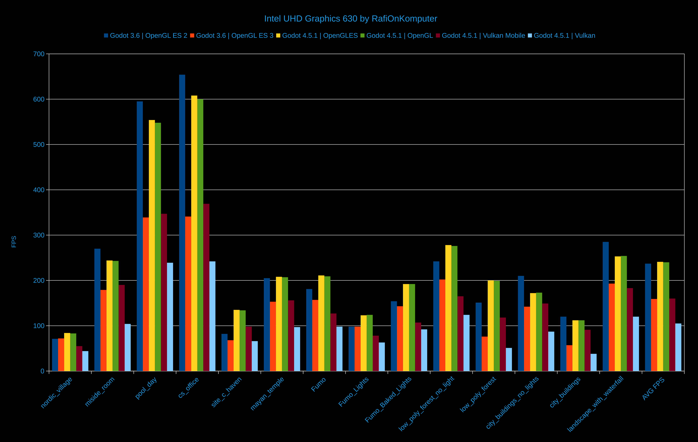
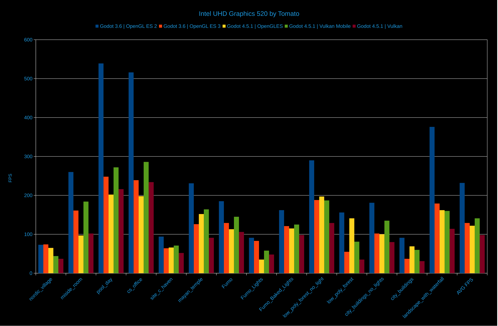
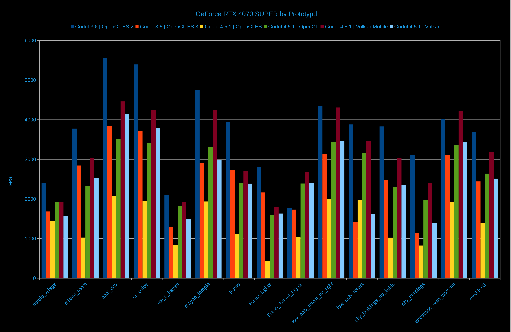
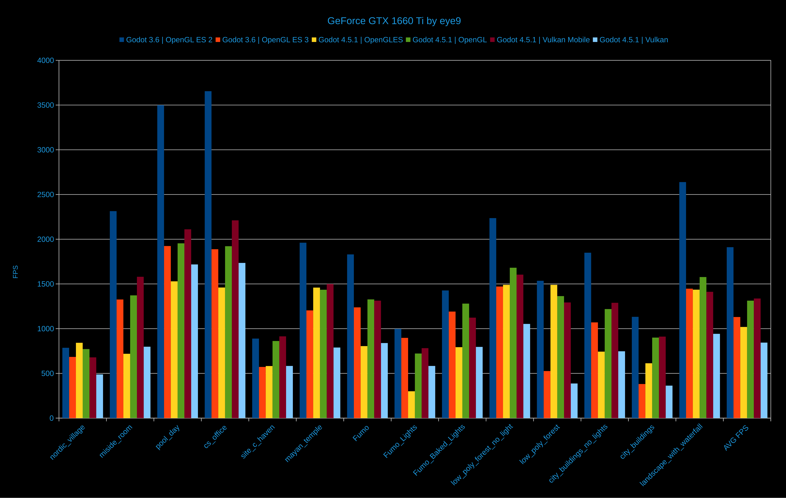
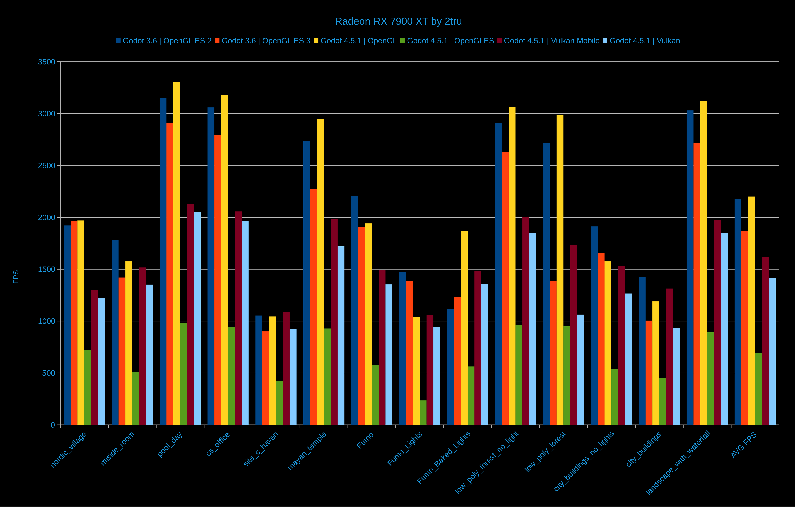
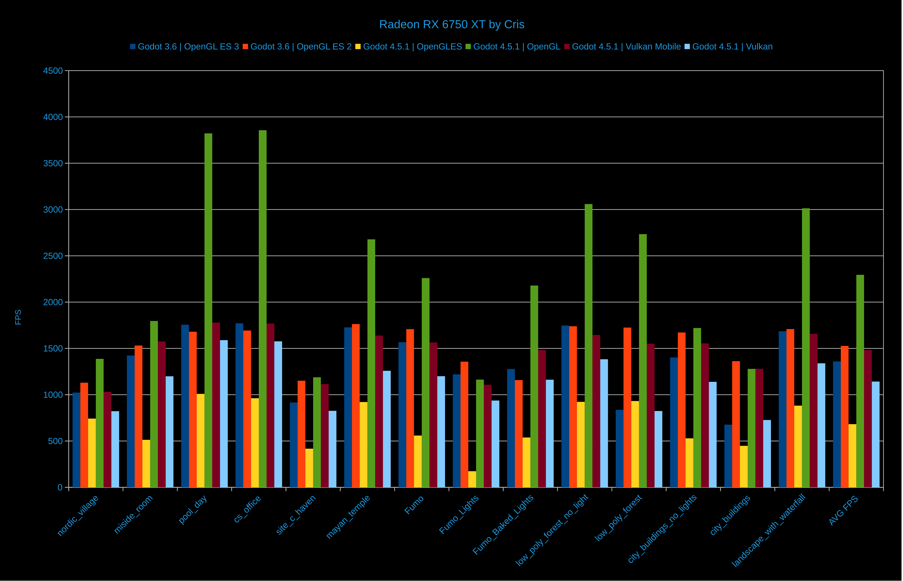
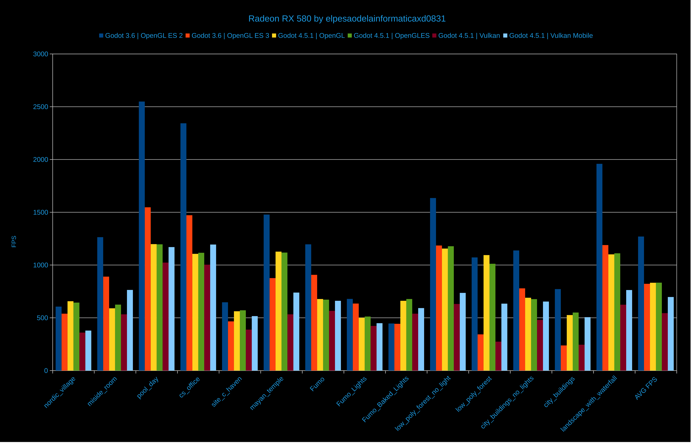

# Godot Benchmark Project 

Goal Of This Benchmark Project Is To Test **Godot 3 vs Godot 4 And OpenGL/GLES vs Vulkan Performance** On New, Old, Fast And Slow Computers. So New Godot Game Developers Can Choose **Engine Version And Graphics API** That Performs Best On Their Target Audience's Hardware :D

> **"Every GPU Can Game... You Just Have To Optimize It Enough....And Also Choose The Right Graphics API ;-;"**

In This Test **We Have Tested Over 24 GPUs From NVIDIA, AMD And Intel**. Some Of Them Are **Old asf** And Some Of Them Are **Modern** GPUs, And Some Are Way Too Slow. ;-;

And We Have Seen Unexpected Results All Over The Place And Understand Godot And Graphics APIs Better 


## YouTube Video

I  Made A YouTube Video That Explains All This In Detail With Visuals!

**You Can Watch It Here:** (I Lied...I didnt released it yet)


##  Credits

All Benchmark Result, Music And 3D Models Used In This Project Belongs To Their Original Creators.

**Full Credits List:** [Credits.md](https://github.com/RafiOnKomputer/The-Godot-Benchmark-Project/blob/main/Credits.md)

# Some Benchmark Result Example
###Intel


###Nvidia


###AMD





##  How Does This Test Work?

I Imported Lotssss Of [Sketchfab 3D Models](https://github.com/RafiOnKomputer/The-Godot-Benchmark-Project/blob/main/Credits.md) And Made The Camera Spin Around For 2-3 Times. The Benchmark Saves The Average FPS In A JSON File Called `benchmark_results.json` In The Same Folder Where The Project Is Executed From. :D

**The JSON File Also Saves:**
- CPU Model Name
- GPU Model Name
- Graphics API Used

> **Note:** Godot 3 Can't Save GPU Model And Graphics API Name D:

### Test Variety

Some Of These 3D Maps/Models Are:
-  Big And Smol
-  High Poly And  Low Poly
-  Using Baked Lighting, Some  Are Using Real-Time Lighting
-  Some Using Shadows And Reflections, Some Without

This Variety Helps Us Understand What Different GPUs Are Good At! :D


##  Key Findings

In This Test We Have Seen That On Most GPUs, **Vulkan Is 2-4x Slower Than OpenGL Or OpenGL ES**.

**The Problem:**
- Vulkan Is Just Not Worth It For Most Cases
- **BUT** In Godot 4, Lots Of OpenGL/OpenGL ES Features Were Removed That Were Available In Godot 3
- Because Of That, Most People Might Not Be Able To Use OpenGL In Godot 4
- Developers Who Want Those OpenGL/OpenGL ES Features **Might Have To Stick With Godot 3** D:


## APIs Used By Godot:

| APIS     | Godot 3   | Godot 4     |
| :------- | :-------- | :---------- |
| OpenGL   | 2.1 – 3.3 | 3.3         |
| GLES     | 2 – 3     | 3           |
| Vulkan   | N/A       | 1 – 1.3     |

## Godot Feature Support Table

Here Is A List Of Feature Support Across Godot 3 And Godot 4 With All Their APIs:

|      Features      | Godot 3 GLES2 | Godot 3 GLES3 | Godot 4 GL/GLES | Godot 4 Vulkan Mobile | Godot 4 Vulkan |
| :----------------: | :-----------: | :-----------: | :-------------: | :-------------------: | :------------: |
|        SSR         |      ❌       |     ✔️      |       ❌        |          ❌           |     ✔️      |
|        SSAO        |      ❌       |     ✔️      |       ❌        |          ❌           |     ✔️      |
|        SSIL        |      ❌       |      ❌       |       ❌        |          ❌           |     ✔️      |
|       SDFGI        |      ❌       |      ❌       |       ❌        |          ❌           |     ✔️      |
|        SSIL        |      ❌       |      ❌       |       ❌        |          ❌           |     ✔️      |
|    Volumetric Fog  |      ❌       |      ❌       |       ❌        |          ❌           |     ✔️      |
|        Fog         |     ✔️      |     ✔️      |      ✔️       |          ✔️           |     ✔️      |
|    Tonemapping     |      ❌       |     ✔️      |      ✔️       |          ✔️           |     ✔️      |
|      MSAA 3D       |     ✔️      |     ✔️      |      ✔️       |          ✔️           |     ✔️      |
|      MSAA 2D       |     ✔️      |     ✔️      |       ❌        |          ✔️           |     ✔️      |
|        TAA         |      ❌       |      ❌       |       ❌        |          ❌           |     ✔️      |
|       FSR2         |      ❌       |      ❌       |       ❌        |          ❌           |     ✔️      |
|       FXAA         |     ✔️      |     ✔️      |       ❌        |          ✔️           |     ✔️      |
|       SSAA         |     ✔️      |     ✔️      |      ✔️       |          ✔️           |     ✔️      |
|    DOF blur        |     ✔️      |     ✔️      |       ❌        |          ✔️           |     ✔️      |
| Light projector textures |     ❌       |      ❌       |       ❌        |          ✔️           |     ✔️      |
| SS roughness limiter |     ❌       |      ❌       |       ❌        |          ✔️           |     ✔️      |
|   2D HDR Viewport  |      ❌       |     ✔️      |       ❌        |          ✔️           |     ✔️      |


**For More Info Read:** [Godot 4 Renderer Doc](https://docs.godotengine.org/en/stable/tutorials/rendering/renderers.html#feature-comparison "Godot 4 Renderer Doc") And [Godot 3 Renderer Doc](https://docs.godotengine.org/en/3.6/tutorials/rendering/gles2_gles3_differences.html# "Godot 3 Renderer Doc")


##  GPU Graphics API Support

Here Is A List Of GPUs With Their Supported Graphics APIs:

### NVIDIA GPUs
|   GPU Series   | OpenGL | Vulkan |
| :------------: | :----: | :----: |
|    RTX 50xx    |  4.6   |  1.4   |
|    RTX 40xx    |  4.6   |  1.3   |
|    RTX 30xx    |  4.6   |  1.3   |
|    RTX 20xx    |  4.6   |  1.3   |
|  GeForce 16xx    |  4.6   |  1.3   |
|   GeForce 10xx |  4.6   |  1.3   |
|   GeForce 9xx  |  4.6   |  1.3   |
|   GeForce 7xx  | 4.6-1.2|  1.3   |

### AMD GPUs
|   GPU Series   |   OpenGL    | Vulkan |
| :------------: | :---------: | :----: |
|    RX 9000     |    4.6      |  1.4   |
|    RX 7000     |    4.6      |  1.3   |
|    RX 6000     |    4.6      |  1.3   |
|     RX 500     | 4.5 - 4.6   | 1.2-1.3|

### Intel GPUs
|       GPU Series       | OpenGL | OpenGL (Linux) | OpenGLES (linux only) | Vulkan | Vulkan (linux) |
|:----------------------:|:------:|:--------------:|:---------------------:|:------:|:--------------:|
|     Iris Xe Graphics   |  4.6   |      4.6       |         3.2           |  1.4   |      1.4       |
|      HD Graphics 7xx   |  4.6   |      4.6       |         3.2           |  1.4   |      1.4       |
|      HD Graphics 6xx   |  4.6   |      4.6       |         3.2           |  1.3   |      1.4       |
|      HD Graphics 5xx   |  4.6   |      4.6       |         3.2           |  1.3   |      1.4       |
|    HD Graphics 5500    |  4.4   |      4.6       |         3.2           |  N/A   |      1.1       |
|    HD Graphics 4600    |  4.3   |      4.6       |         3.2           |  N/A   |       1        |
|    HD Graphics 4000    |   4    |       4        |          3            |  N/A   |       1        |
|    HD Graphics 2500    |   4    |       4        |          3            |  N/A   |       1        |
|   HD Graphics 3000     |  3.1   |      3.3       |          3            |  N/A   |      N/A       |
|      HD Graphics       |  3.1   |      3.3       |          3            |  N/A   |      N/A       |


#Test Yourself!

You Can Just Download The Compiled Project And Test Them Right Away! :D

**Download From:**
- [itch.io](https://rafionkomputer.itch.io/the-godot-benchmark-project) 
- [GitHub Releases](https://github.com/RafiOnKomputer/The-Godot-Benchmark-Project/releases)


##  How To BUILD

### Step 1: Download Files

1. Download This Repository :3
2. [Download Map_Data.7z](https://github.com/RafiOnKomputer/The-Godot-Benchmark-Project/releases/download/Release/Map_Data.7z) From Release Tab

> **Note:** Because Of File Upload Limit, Map Data Was Separated

> You Can Also Download This Repo From [GitLab](https://gitlab.com/RafiOnKomputer/The-Godot-Benchmark-Project) Or [Codeberg](https://codeberg.org/RafiOnKomputer/The-Godot-Benchmark-Project)! (Map_Data Still Needs To Be Downloaded From GitHub)

### Step 2: Extract And Setup

1. Extract All Files Using 7-Zip
2. Copy-Paste The `Map_Data` Folder Into **ALL** Project Folders Like This:
```
The-Godot-Benchmark-Project/
└── Godot Project Files/
    ├── Godot 3 - GLES 2/Map_Data/
    ├── Godot 3 - GLES 3/Map_Data/
    ├── Godot 4 - OpenGL/Map_Data/
    ├── Godot 4 - OpenGLES/Map_Data/
    ├── Godot 4 - Vulkan/Map_Data/
    └── Godot 4 - Vulkan Mobile/Map_Data/
```

### Step 3: Open In Godot

> **⚠️ Important:**
> - **Godot 3 - GLES2** And **Godot 3 - GLES3** Should Only Be Opened Using **Godot 3.6.1 Or Higher !!!**
> - **Godot 4 - OpenGL**, **Godot 4 - OpenGLES**, **Godot 4 - Vulkan**, **Godot 4 - Vulkan Mobile** Should Only Be Opened Using **Godot 4.5.1 Or Higher !!!**


##  Contributing

Want To Help? You Can:
- Run The Benchmarks On Your PC And Share Results!

**Share Your Results:** Open An Issue Or Pull Request With Your `benchmark_results.json` File! :D


##  License

This Project Is Licensed Under The MIT License.


**Made With 💜 By RafiOnKomputer**

*This Project Took Way Too Long Because Of ADHD, But It's Finally Done!*  teehee :3
